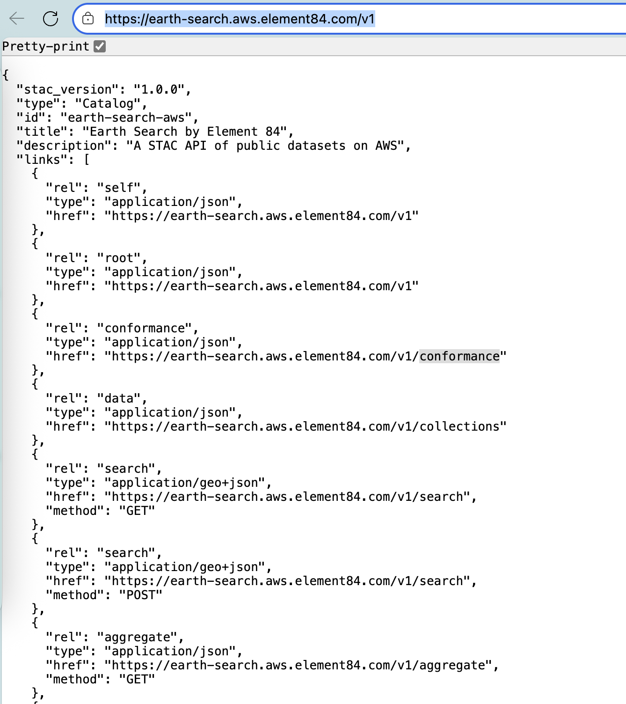
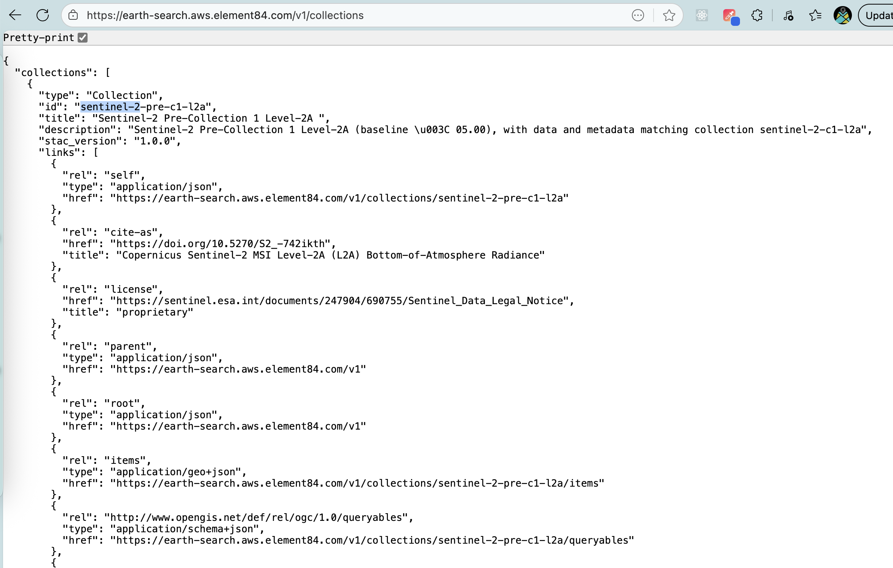
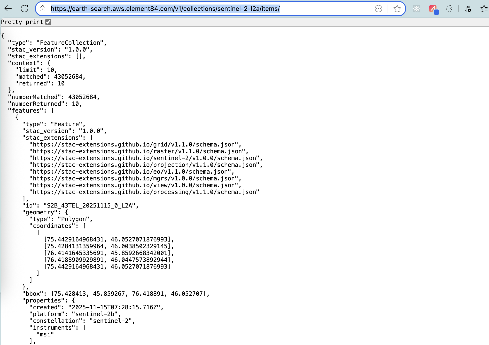
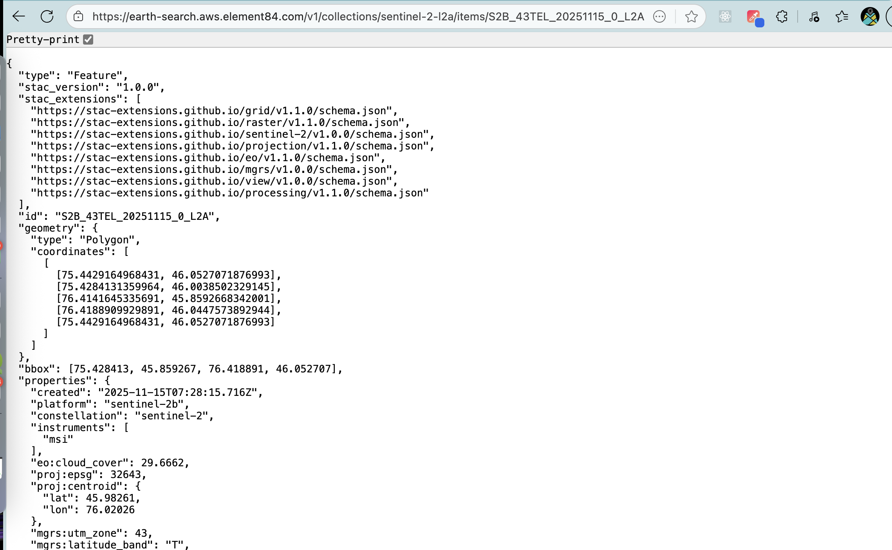

# What is STAC?

- STAC (SpatioTemporal Asset Catalog) is an open specification for describing geospatial assets (imagery, point clouds, vectors, etc.) using simple JSON and links.
- Designed so catalogs are searchable, interoperable, and easy to host (static files, object stores, or dynamic APIs).

#  Presentation outline

1. What STAC is (core concepts)
2. Why we need STAC (problems it solves)
3. STAC components & ecosystem
4. Current progress & standards status
5. Working groups and governance
6. Use cases & examples
7. Organizations maintaining and supporting STAC
8. Demos / resources / next steps

#  Core concepts{.smaller}

## **Catalog**  - hierarchical container of metadata (can be static or dynamic).{.smaller}

[https://earth-search.aws.element84.com/v1](https://earth-search.aws.element84.com/v1)

---

## **Collection** - metadata describing a collection of items (extent, license, providers).{.smaller}

[https://earth-search.aws.element84.com/v1/collections](https://earth-search.aws.element84.com/v1/collections)

---

## **{collection}/Items** — a GeoJSON FeatureCollection representing all items available in that collection.{.smaller}

[https://earth-search.aws.element84.com/v1/collections/sentinel-2-l2a/items/](https://earth-search.aws.element84.com/v1/collections/sentinel-2-l2a/items/)

---

## **{collection}/Items/{id}** — a GeoJSON Feature of single items available in that collection based on id.{.smaller}

[https://earth-search.aws.element84.com/v1/collections/sentinel-2-l2a/items/S2B_43TEL_20251115_0_L2A](https://earth-search.aws.element84.com/v1/collections/sentinel-2-l2a/items/S2B_43TEL_20251115_0_L2A)

#  Why we need STAC — Problems addressed{.smaller}

- Fragmented metadata: different providers use different schemas making discovery hard.
- Hard-to-discover assets: lack of a common search protocol across providers.
- Cloud-native workflows: need for lightweight, object-store-friendly catalogs that integrate with cloud processing.
- Interoperability: ease of connecting catalogs to analysis tools, visualization, and ML pipelines.

#  How STAC solves these problems

- Provides a minimal, extensible JSON schema that is easy to implement.
- Works with static hosting (S3/HTTP) and dynamic servers (STAC API).
- Extensions let domain-specific metadata evolve without breaking core compatibility.
- Aligns with modern web and OGC API patterns (pagination, filtering, GeoJSON responses).

#  STAC Specification components

- **Core spec** — Items, Collections, Catalogs.
- **STAC API** — search, item/collection endpoints, conformance to OGC API ideas.
- **Extensions** — EO, SAR, Items-Statistics, Label, Pointcloud, Datacube, Projection, etc.
- **Reference implementations & tooling** — libraries (pystac-client, stac.js), servers (planetary-computer (Microsoft), Earth-search (AWS)), browsers, validators.

#  Current progress (high level)

- STAC has mature core specs and multiple stable extensions.
- STAC API reached wide adoption and alignment with OGC API principles.
- Growing ecosystem of libraries, validators, and hosted catalogs (public cloud providers, national data portals).

#  Important websites and links

- [https://stacspec.org/](https://stacspec.org/) - Homepage for stac specification updates
- [https://radiantearth.github.io/stac-browser/](https://radiantearth.github.io/stac-browser/#/?.language=en) - UI to check existing STAC endpoints as well as test your end points
- [Google Group](https://groups.google.com/a/cloudnativegeo.org/g/stac-community?pli=1) - STAC community google group for general discussion
- [stac-utils](https://github.com/stac-utils) - Repository with various utilities created around STAC

#  Example use cases

- **Cataloging satellite imagery** — index granules, search by area/date/cloud cover, link to Cloud-optimized GeoTIFFs.
- **Machine learning training data** — Label extension for storing training labels and links to assets.
- **Point cloud catalogs** — pointcloud extension and indexing LiDAR tiles.
- **Data discovery portals** — offering unified search across multiple providers.
- **Processing pipelines** — serverless workflows that read `assets[].href` directly from object storage.

#  Organizations & projects using / maintaining STAC

- Open source community contributors
- Common participants: Radiant Earth, cloud providers, national agencies, research groups, private companies.
- Many data portals expose STAC-compliant catalogs.

# Now that we know theory, it's time to 🏊‍♂️

- Thank you!
- Contact: Krishna Lodha 
- Email : [krishna@rottengrapes.tech](mailto:krishna@rottengrapes.tech)

